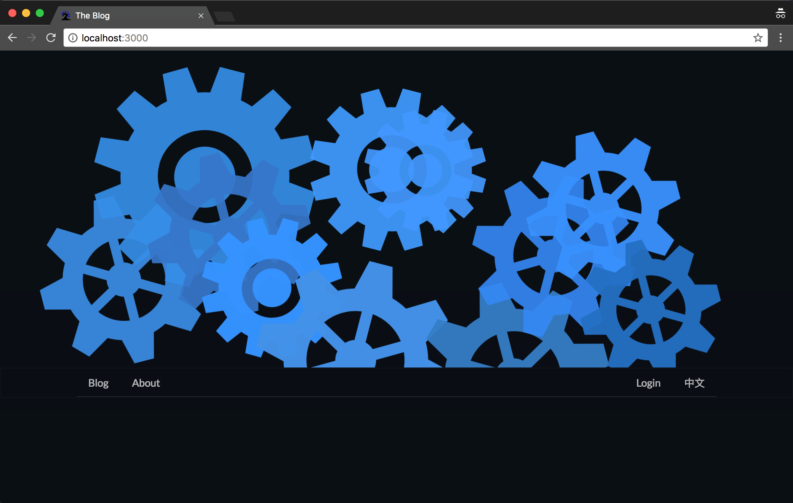
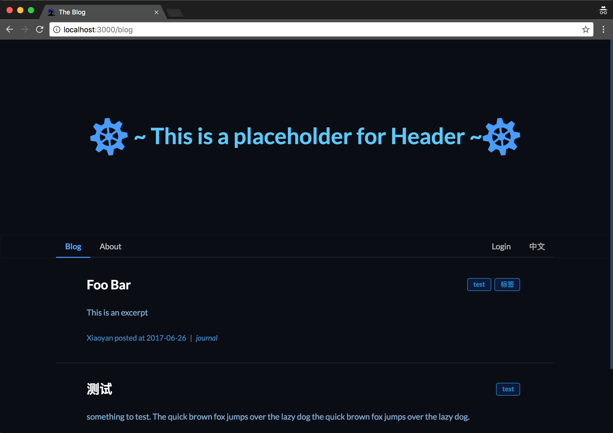
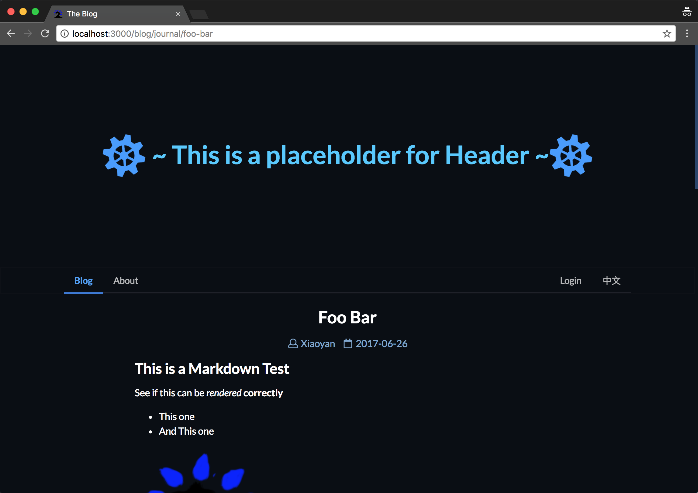
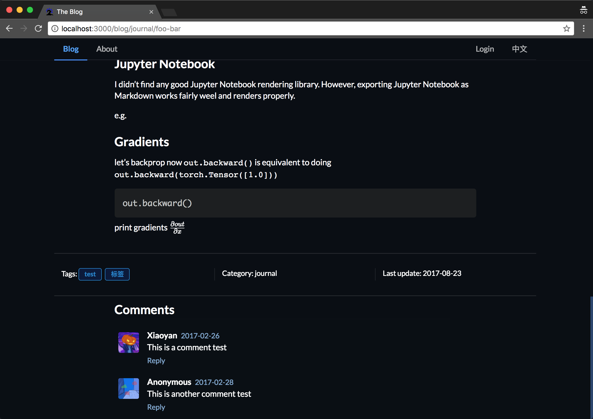
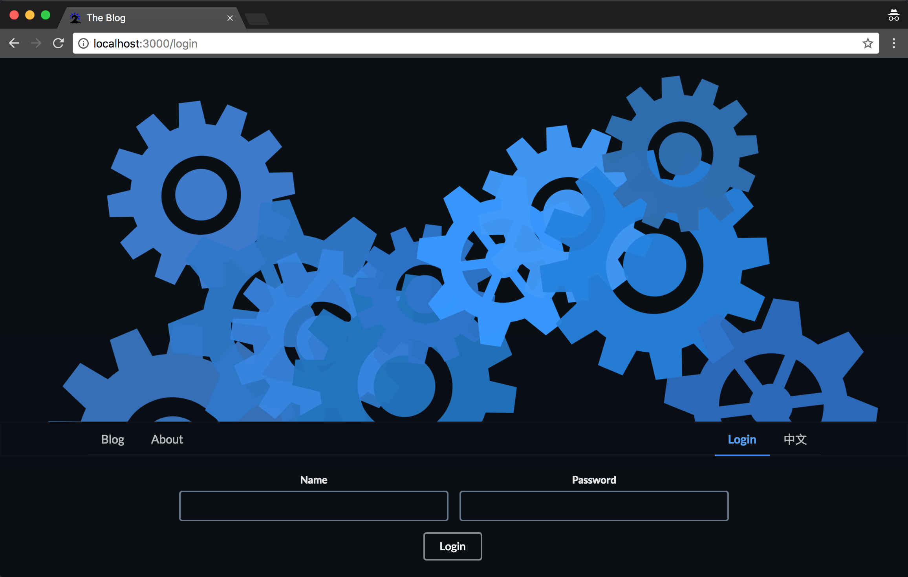
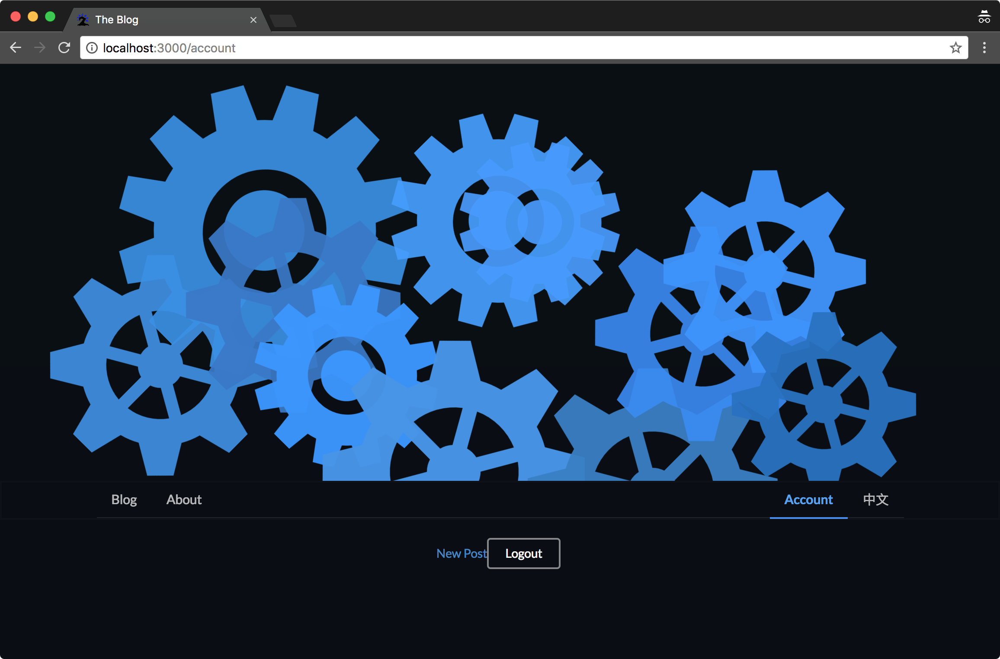
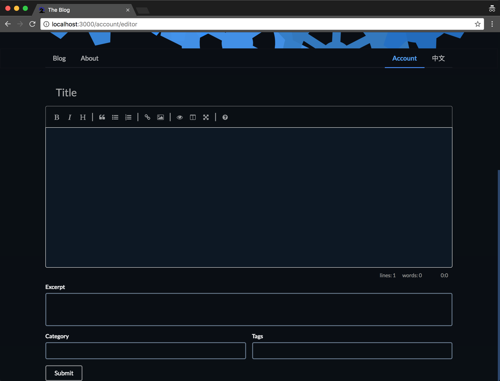
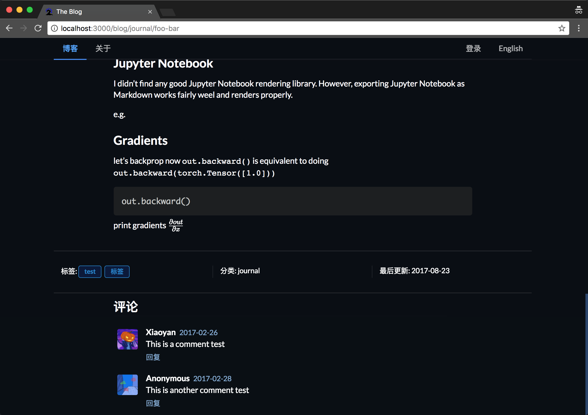

# CS 242 Final Project Manual Test Plan

Xiaoyan Wang (xiaoyan5@illinois.edu)

## Home Page

The first page user should see when enter `/` is the home page,
which includes the header and the navigation bar. The content of Header and navigation bar might looks different, but the layout should be the same.

Users can click on the content of the navigation bar, which will bring them to the corresponding page. The headers and navigation bar should remains the same across all pages.

## Blog

### Blog List

After clicking at "Blog" in the menu bar, user should navigate to the `/blog` page, which should looks as follows:

This page display a list of blog posts, their title, excerpt, author, created date, category, and tags. The each item should display a background color when user hover their mouse on top of it.

### Blog Post

Users will navigate to `/blog/:category/:post` when they click at an entry in the blog list, which will open up the blog post page corresponds to the content they just selected.

The title will be displayed as the top, and under the title, user should see the author, post's created date, and the blog content.

At the bottom of each post, user should see a section that shows the tags of the post, category of the post, and the last update time of the post (this might be different from the created date), as shown below.

In addition, there will be a comment section at the very bottom that shows a list of comment that other users have on the post.

## Login

After clicking the `Login` button on the navigation bar, the user should see the login page, where he or she can enter the login credentials.

## Account

The account page should display the basic information about the user and allows the user to log out. Currently it is empty, but more information will be add later on

### Editor

If the user is admin, he or she can see and post new content using the post editor, which is located at `/account/editor`

## Miscellaneous

### Switching Language

The rightmost button at the navigation bar is a language toggle that allows user to switch between Chinese (Mandarin) and English (US). The page will not reload when user clicks the button. Instead, the translation will be directly applied to the page.

(The blog post contents and comments will not be translated)

